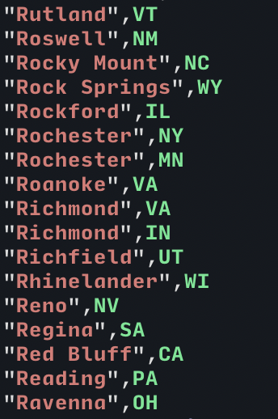
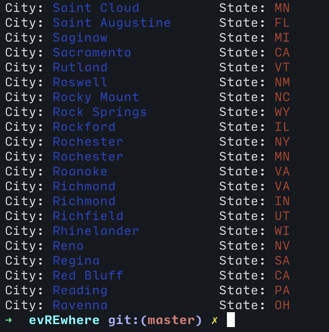
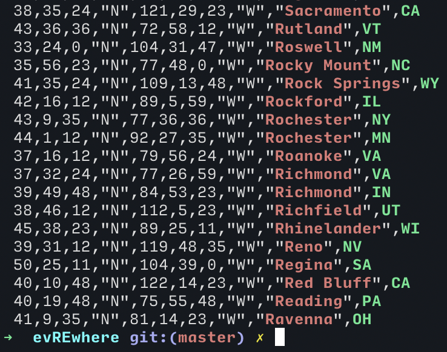

# 
_Multiline Regex Matcher with colors_

Created this because `grep` does not allow me to display regex group captures, format them and put color in between. Grep is also quite limited in Regexp Syntax (even with `-P`).

## Usage

```bash
$ tail cities.csv
 40,45,35,"N",111,52,47,"W","Salt Lake City",UT
 38,22,11,"N",75,35,59,"W","Salisbury",MD
 36,40,11,"N",121,39,0,"W","Salinas",CA
 38,50,24,"N",97,36,36,"W","Salina",KS
 38,31,47,"N",106,0,0,"W","Salida",CO
 44,56,23,"N",123,1,47,"W","Salem",OR
 44,57,0,"N",93,5,59,"W","Saint Paul",MN
 38,37,11,"N",90,11,24,"W","Saint Louis",MO
 39,46,12,"N",94,50,23,"W","Saint Joseph",MO
 42,5,59,"N",86,28,48,"W","Saint Joseph",MI
 44,25,11,"N",72,1,11,"W","Saint Johnsbury",VT
 45,34,11,"N",94,10,11,"W","Saint Cloud",MN
 29,53,23,"N",81,19,11,"W","Saint Augustine",FL
 43,25,48,"N",83,56,24,"W","Saginaw",MI
 38,35,24,"N",121,29,23,"W","Sacramento",CA
 43,36,36,"N",72,58,12,"W","Rutland",VT
 33,24,0,"N",104,31,47,"W","Roswell",NM
 35,56,23,"N",77,48,0,"W","Rocky Mount",NC
 41,35,24,"N",109,13,48,"W","Rock Springs",WY
 42,16,12,"N",89,5,59,"W","Rockford",IL
 43,9,35,"N",77,36,36,"W","Rochester",NY
 44,1,12,"N",92,27,35,"W","Rochester",MN
```

We could extract only City and State, and format them.

```bash
$ evre '"([^,]{2,})".*([A-Z]{2})' cities.csv -f 'City: {1:<20} State: {2}'
City: Salt Lake City       State: UT
City: Salisbury            State: MD
City: Salinas              State: CA
City: Salina               State: KS
City: Salida               State: CO
City: Salem                State: OR
City: Saint Paul           State: MN
City: Saint Louis          State: MO
City: Saint Joseph         State: MO
City: Saint Joseph         State: MI
City: Saint Johnsbury      State: VT
City: Saint Cloud          State: MN
City: Saint Augustine      State: FL
City: Saginaw              State: MI
City: Sacramento           State: CA
City: Rutland              State: VT
City: Roswell              State: NM
City: Rocky Mount          State: NC
City: Rock Springs         State: WY
City: Rockford             State: IL
City: Rochester            State: NY
City: Rochester            State: MN
City: Roanoke              State: VA
City: Richmond             State: VA
City: Richmond             State: IN
```

By not supplying the template (`-f`), captured groups will be highlighted with different colors.

```bash
$ evre '"([^,]{2,})".*([A-Z]{2})' cities.csv
```


Color can be added through formatting syntax...

```bash
$ evre '"([^,]{2,})".*([A-Z]{2})' cities.csv -f 'City: {BLUE}{1:<20}{None} State: {RED}{2}'
```


And with `-g` we can see full lines just like the default behavior in `grep`

```bash
$ evre '"([^,]{2,})".*([A-Z]{2})' cities.csv -g
```



### Key differences between `evre` and `grep`
- Support for full Regular Expression Syntax from Python
- `-f` passes a template parameter which can be used with Python formatting syntax
  - e.g.: `-f '{2} {1}'` or `-f '{1:.4} {1:>30} {1}'`
  - `{0}` is full match, `{1}`, `{2}`, ... represent respective capture group numbers depending on the pattern
- Templates accept colors, e.g.: `-f '{RED}{1}{None}:{2} {3}'`
- With `-a`, `--dot-all` - dot (.) can include newline characters and search multiline
- Symbolic links are not recognized and ignored
- `evre` does not (yet?) provide on-the-fly results - these are cached
- `grep` is more performance-oriented, though, `evre` does not fall behind too far
- By default, only matches are displayed as results. However, they can be shown as lines (`-g`) like in `grep`

### Color formats

Put these into a template (`-f`) to achieve coloring.

- `{RED}`
- `{GREEN}`
- `{YELLOW}`
- `{BLUE}`
- `{MAGENTA}`
- `{CYAN}`
- `{None}` - restores to the default color

# Examples

Examples use evre as a module, not as a utility program like grep. This gives more flexibility to how the output is displayed and allows to overwrite the Match Handler (e.g. to account for false positives).

One example searches through directories looking for unnecessary C++ template parameters.

Here's what it can do:


# Requirements

- Python 3.8+
- colorama - optional if `EVREDONTUSECOLOR=1` is set in environment variables
